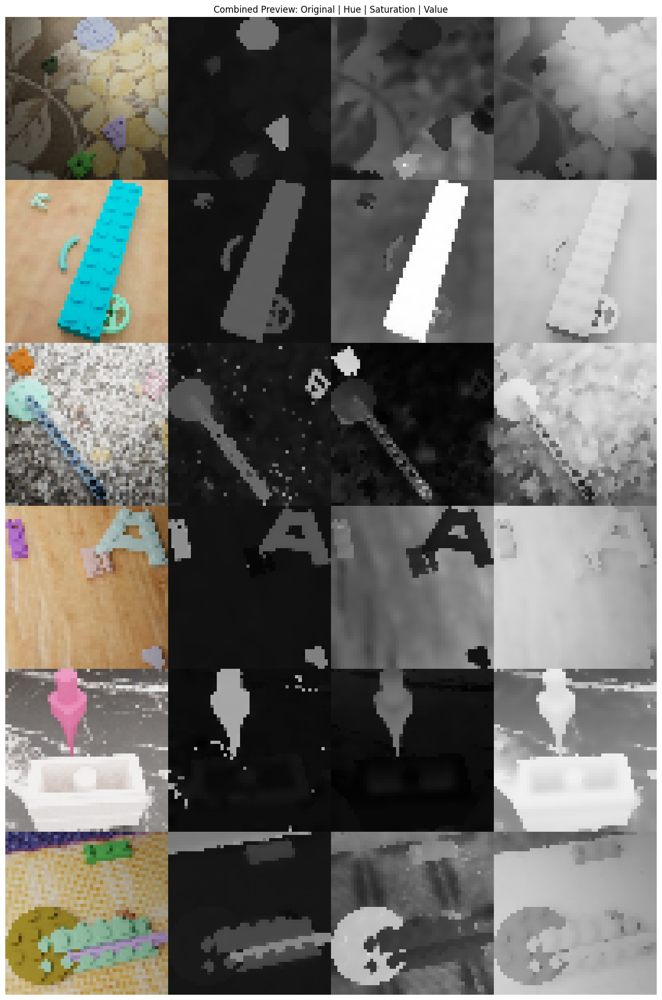

# LEGO Labz

LEGO Lab is a computer vision project designed to process and analyze images of LEGO pieces. The repository includes code for image preprocessing (with mean shift filtering), dataset splitting, XML annotation processing, and training a ResNet18 model for LEGO piece count regression. Additionally, it offers interactive evaluation and further training options.

## Table of Contents

- [LEGO Labz](#lego-labz)
  - [Table of Contents](#table-of-contents)
  - [Overview](#overview)
  - [Features](#features)
  - [Installation](#installation)
  - [Data Preparation](#data-preparation)
  - [Image Preprocessing](#image-preprocessing)
    - [Preprocessed Image Example](#preprocessed-image-example)
  - [Dataset Splitting](#dataset-splitting)
  - [XML Annotation Processing](#xml-annotation-processing)
  - [Training the Model](#training-the-model)
  - [Evaluation](#evaluation)
  - [Usage](#usage)
  - [Gradio Interface](#gradio-interface)
  - [Git Setup \& .gitignore](#git-setup--gitignore)

## Overview

LEGO Lab is a modular project that processes a large dataset of LEGO images, extracts and caches annotations from XML files, splits the dataset into training, validation, and test subsets, and trains a dynamically quantized ResNet18 model to predict the number of LEGO pieces in an image. The project also provides an interactive terminal interface for further training and evaluation and a Gradio-based web interface for testing the model.

## Features

- **Environment Check:** Reports versions for OpenCV, PyTorch, and CUDA availability.
- **Image Preprocessing:** Applies mean shift filtering in HSV color space after resizing images.
- **Dataset Splitting:** Splits processed images into training, validation, and test sets using an 80/20 (and further 80/20) split.
- **XML Annotation Processing:** Parses XML files to count LEGO pieces per image and caches the results.
- **Model Training & Evaluation:** Uses a pretrained ResNet18 (with a modified final layer) for regression. The model is dynamically quantized for efficient CPU inference.
- **Interactive Terminal:** Users can continue training the model or evaluate its performance interactively.
- **Gradio Interface:** A web interface for uploading images and testing model predictions.

## Installation

1. **Clone the Repository:**

   ```bash
   git clone https://github.com/KalharPandya/lego-lab.git
   cd lego-lab
   ```

2. **Create and Activate a Virtual Environment (optional but recommended):**

   ```bash
   python -m venv venv
   source venv/bin/activate    # Linux/MacOS
   venv\Scripts\activate       # Windows
   ```

3. **Install Dependencies:**

   Ensure you have Python 3.8 or later installed. Then, install the required packages:

   ```bash
   pip install -r requirements.txt
   ```

   Example `requirements.txt`:

   ```
   torch>=2.0.0
   torchvision>=0.15.0
   Pillow>=9.0.0
   gradio>=4.0.0
   opencv-python>=4.5.5.64
   matplotlib>=3.5.0
   scikit-learn>=1.0.2
   tqdm>=4.64.0
   ```

## Data Preparation

- **Raw Images:**  
  Place your raw LEGO images in the directory specified by `RAW_IMAGES_DIR` (e.g., `lego_dataset/dataset_20210629145407_top_600/images`).

- **Annotations:**  
  XML annotation files should be located in the directory specified by `ANNOTATIONS_DIR` (e.g., `lego_dataset/dataset_20210629145407_top_600/annotations`).

## Image Preprocessing

The preprocessing step resizes raw images to a target size (default is 224×224) and applies mean shift filtering twice in HSV color space to smooth and segment the image. The processed images are then cached in the `PROCESSED_IMAGES_DIR` to avoid reprocessing on subsequent runs.

Key steps in `process_images()`:
- **Resize:** Images are resized to 224×224 pixels.
- **Color Conversion:** Images are converted from BGR to HSV.
- **Mean Shift Filtering:** Two rounds of `cv2.pyrMeanShiftFiltering` are applied with configurable spatial and range parameters.
- **Reconversion & Saving:** The filtered image is converted back to BGR and saved.

### Preprocessed Image Example

The image below (`preprocessed.png`) is an example of a processed image. Preprocessing enhances key features in the image, making it easier for the model to accurately count LEGO pieces.




## Dataset Splitting

After preprocessing, the images are split into training, validation, and test sets using the `train_test_split` method from scikit-learn. The first split divides the dataset into 80% training+validation and 20% test; the training+validation split is then further split into approximately 80% training and 20% validation. Files are copied to respective directories under `OUTPUT_SPLIT_DIR`.

## XML Annotation Processing

The XML annotation files are parsed to extract the count of LEGO pieces per image. The counts are cached as a NumPy dictionary (saved as `annotation_counts.npy`) so that repeated runs do not need to reprocess XML files. A histogram of piece counts is also plotted for visualization.

## Training the Model

The model is built using a pretrained ResNet18 with its final fully connected layer replaced by a linear layer (outputting a single regression value representing the LEGO piece count). Key aspects:

- **Dynamic Quantization:**  
  After training, the model is dynamically quantized (only on CPU) for efficient inference. The quantized state dictionary is saved to `MODEL_PATH`.

- **Training Workflow:**  
  The training code checks for existing processed images, dataset splits, and cached annotations. It then either trains a new model or loads an existing checkpoint. Users can interactively continue training or evaluate the model using the terminal interface.

## Evaluation

The evaluation function computes:
- Mean Squared Error (MSE)
- Mean Absolute Error (MAE)
- Percentage Error (MAPE-like measure)
- Exact match Accuracy (rounded predictions)
- F1 Score (macro)
- Classification report and confusion matrix

Pre-computed evaluation metrics (e.g., on a test dataset with 33,560 samples) are also provided in the Gradio interface.

## Usage

Run the training script:
```bash
python lego_training.py
```
Follow the terminal prompts to continue training or evaluate the model on validation/test sets.

## Gradio Interface

A Gradio web interface (`app.py`) is provided for testing the model. Users can upload one or more images to receive predictions, which are formatted as text (showing predicted LEGO piece count along with a confidence measure). The interface also displays the scientific evaluation metrics.

Launch the interface with:
```bash
python app.py
```

## Git Setup & .gitignore

To set the remote URL for this repository:
```bash
git remote add origin https://github.com/KalharPandya/lego-lab.git
```
To ignore all folders (if needed), you can add:
```
*/
```
in your `.gitignore` file, then selectively un-ignore specific file types using:
```
!*.py
!*.md
```
